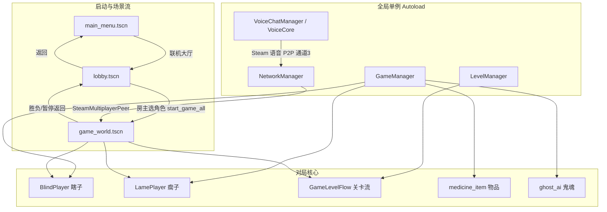
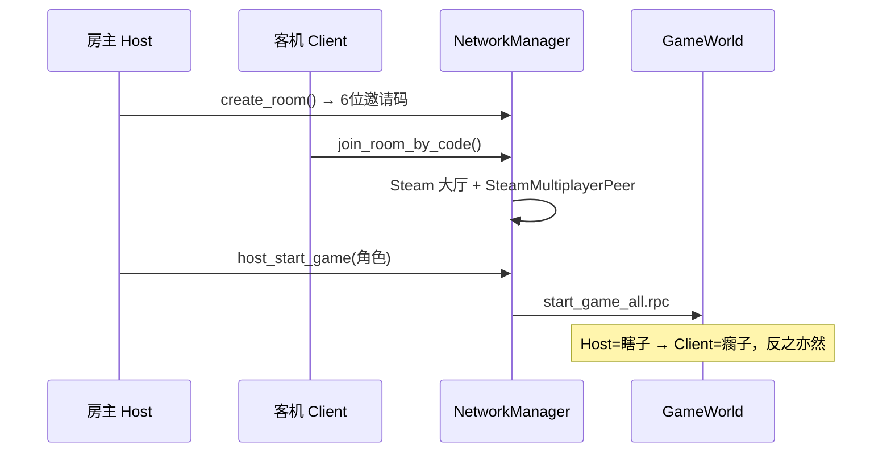
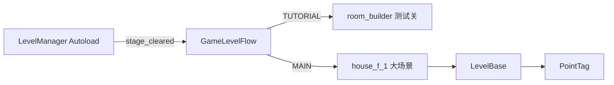
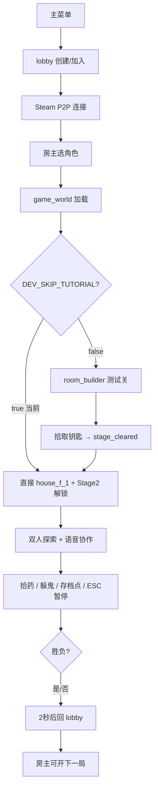
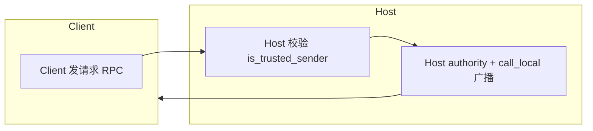

# 《瘸子和瞎子》项目架构说明（2026-07 最新版）

Godot **4.6** 双人合作恐怖游戏。核心玩法：**瞎子**负责移动与视野（屏幕下方半圆孔），**瘸子**背负在瞎子身上、负责交互与语音；两人通过 **Steam P2P 联机**协作通关。当前**单机入口已关闭**，必须从联机大厅进入。

---

## 一、整体架构总览



---

## 二、目录结构

```
blind_and_lame_Project1/
├── project.godot              # 项目入口配置
├── steam_appid.txt            # Steam 测试 AppID (480)
├── export_presets.cfg         # Windows 导出预设
├── database_guide.gd          # 存档方案设计文档（未接入）
│
├── scripts/                   # ★ 全部游戏逻辑
│   ├── game_manager.gd        # 游戏状态 / 数值 / 胜负
│   ├── network_manager.gd     # Steam 联机
│   ├── VoiceCore.gd           # Steam 语音
│   ├── main_menu.gd           # 主菜单
│   ├── lobby.gd               # 联机大厅
│   ├── game_world.gd          # 对局总控
│   ├── blind_player.gd        # 瞎子
│   ├── lame_player.gd         # 瘸子
│   ├── medicine_item.gd       # 可拾取物品
│   ├── ghost_ai.gd            # 鬼魂 AI
│   ├── room_builder.gd        # 测试关程序化生成
│   ├── checkpoint_trigger.gd  # 存档点
│   ├── light_flicker.gd       # 灯光闪烁
│   ├── input_mouse_guard.gd   # 鼠标捕获工具
│   ├── networked_authority_interactable.gd  # 联机交互基类
│   └── LevelSystem/           # 关卡子系统
│       ├── LevelManager.gd
│       ├── GameLevelFlow.gd
│       ├── LevelBase.gd
│       └── PointTag.gd
│
├── scenes/                    # ★ 场景与 Prefab
│   ├── main_menu.tscn
│   ├── lobby.tscn
│   ├── game_world.tscn
│   ├── blind_player.tscn + blind_player.gdshader
│   ├── lame_player.tscn
│   ├── medicine_item.tscn
│   ├── ghost.tscn
│   ├── house_f_1.tscn         # 主关卡包装场景
│   ├── test.tscn + test.gd
│   └── GameModeScene/         # (gitignore) houseF1.glb 等
│
├── addons/godotsteam/         # Steam 插件（含各平台二进制）
├── .vscode/                   # 编辑器扩展推荐
├── .godot/                    # 编辑器缓存（不纳入版本管理）
├── Levels/、Environment/      # 预留目录（当前为空）
└── scripts/地下室.blend       # Blender 源文件（美术资源）
```

| 路径 | 作用 | 备注 |
|------|------|------|
| `project.godot` | 项目入口 | 主场景、Autoload、输入映射、物理层、Steam |
| `scripts/` | 全部游戏逻辑 | 核心代码 |
| `scripts/LevelSystem/` | 关卡子模块 | 流程调度、关卡基类、标记点 |
| `scenes/` | 场景与 Prefab | UI、玩家、关卡、物品 |
| `scenes/GameModeScene/` | 大型 3D 模型 | **被 .gitignore 忽略**，需本地放置 `houseF1.glb` |
| `addons/godotsteam/` | Steam 集成 | 联机 + 语音底层 |
| `database_guide.gd` | 数据持久化方案 | 非运行代码，存档设计参考 |
| ~~`game_room.tscn`~~ | ~~旧备用房间~~ | **已删除**，统一使用 `lobby.tscn` |

---

## 三、Autoload 全局单例

| 单例 | 脚本 | 职责 |
|------|------|------|
| `GameManager` | `game_manager.gd` | 角色、心理值/疼痛值、胜负、谜题、存档点、暂停、语音 Tier 映射 |
| `NetworkManager` | `network_manager.gd` | Steam 初始化、大厅、邀请码、P2P 联机、语音 P2P、场景路径常量 |
| `VoiceChatManager` | `VoiceCore.gd` | Steam 语音采集/播放；疼痛影响发麦与听筒音量 |
| `LevelManager` | `LevelSystem/LevelManager.gd` | 关卡切换总调度（局内流程 + 整场景切换） |

### 物理碰撞层

| Layer | 名称 | 用途 |
|-------|------|------|
| 1 | environment | 关卡墙体、地板 |
| 2 | player | 瞎子胶囊体（唯一挡墙角色） |
| 3 | ghost | 鬼魂 |
| 4 | items | 物品交互射线（mask 8） |

### 输入映射

| 动作 | 键 | 用途 |
|------|-----|------|
| `move_*` | WASD | 瞎子移动 |
| `interact` | E | 交互拾取 |
| `pause_game` | ESC | 暂停菜单 |
| `push_to_talk` | V | 按住说话（可选，默认常开麦） |

---

## 四、场景流与 UI 层



### 场景文件

| 文件 | 类型 | 负责内容 |
|------|------|----------|
| `scenes/main_menu.tscn` | UI | 主菜单；单机按钮已隐藏，仅「联机大厅」「退出」 |
| `scenes/lobby.tscn` | UI | **唯一联机大厅**：创建/加入、邀请码、选角色、断线提示、会话管理 |
| `scenes/game_world.tscn` | 3D 根场景 | 对局容器：生成玩家、物品、暂停 UI、关卡流 |
| `scenes/blind_player.tscn` | 玩家 Prefab | 瞎子 + 相机 + 半圆视野 Shader + 心理值 UI |
| `scenes/lame_player.tscn` | 玩家 Prefab | 瘸子 + 疼痛 UI + 交互 |
| `scenes/medicine_item.tscn` | 可交互物品 | 心理药 / 止痛药 / 钥匙碎片 |
| `scenes/ghost.tscn` | 敌人 Prefab | Stage2 巡逻鬼魂 |
| `scenes/house_f_1.tscn` | 主关卡 | 实例化 `houseF1.glb`，挂 `LevelBase.gd`，含出生点/AirWall/鬼魂路径 |
| `scenes/blind_player.gdshader` | Shader | 瞎子「半圆孔视野 + 孔外纯黑」遮罩 |
| `scenes/test.tscn` | 测试 | Steam 初始化 smoke test |

---

## 五、脚本模块详解

### 5.1 网络与大厅

| 脚本 | 模块 | 核心职责 |
|------|------|----------|
| `network_manager.gd` | **联机基础设施** | Steam 初始化；创建/搜索/加入大厅；6 位邀请码；`SteamMultiplayerPeer`；语音 P2P 通道 3；断线清理；`LOBBY_SCENE` / `GAME_WORLD_SCENE` 常量 |
| `lobby.gd` | **联机大厅 UI** | 创建/加入房间；Steam 状态检测；房主选角色；对局结束回大厅；断线弹窗；「断开联机」 |
| `main_menu.gd` | **入口** | 跳转大厅；显示断线提示；退出时清理网络/语音 |

**联机权威模型：**
- **Host（peer_id=1）** 为 Authority：胜负、暂停、存档、物品拾取、鬼魂 AI、关卡切换
- **Client** 发请求 RPC → Host 校验 → Host 广播 `call_local`
- `BlindPlayer` 的 authority 固定为 1（Host）

---

### 5.2 游戏状态与规则

| 脚本 | 模块 | 核心职责 |
|------|------|----------|
| `game_manager.gd` | **全局游戏规则** | 心理值（瞎子，持续衰减）/ 疼痛值（瘸子，持续上升）；药物与谜题；存档点；`is_paused` 暂停状态；语音 Tier 与疼痛映射；联机 RPC 同步 game_over |

**关键信号：**
- `mental_health_changed` / `pain_value_changed` → UI 与语音
- `stage_cleared` → 测试关通关，进入大场景
- `game_over_triggered` → 整局胜负
- `pause_changed` → 暂停状态同步（UI、视野遮罩）

**暂停守卫：** `update_mental_health()` / `update_pain()` 在 `is_paused` 时不再更新。

---

### 5.3 玩家控制

| 脚本 | 角色 | 核心职责 |
|------|------|----------|
| `blind_player.gd` | **瞎子（Authority 移动体）** | WASD + 鼠标；`move_and_slide()` 挡墙；半圆视野 Shader；心理值 UI；联机位移/旋转同步；暂停时停物理、隐藏 VisionMask |
| `lame_player.gd` | **瘸子（无碰撞影子）** | 跟随 `BlindPlayer/CarryAnchor`；交互射线（E）；疼痛 UI；疼痛值网络同步；暂停时停疼痛更新 |

**协作机制：**
- 瞎子 = 腿 + 墙 + 视野
- 瘸子 = 眼（交互）+ 嘴（语音）
- 疼痛越高 → 瘸子发麦越弱 / 瞎子听瘸子越小声（Tier 0 禁发 + -80dB）

---

### 5.4 语音系统

| 脚本 | 模块 | 核心职责 |
|------|------|----------|
| `VoiceCore.gd` | **Steam 语音** | 麦克风采集 → P2P 发送；远端 PCM 解码 → `AudioStreamGenerator` 播放；疼痛 Tier 控制发麦/音量；暂停/恢复/关闭生命周期 |

**疼痛 → 音量映射（`game_manager.gd`）：**

| 疼痛值 | Tier | 瞎子听到音量 | 瘸子发麦 |
|--------|------|-------------|---------|
| 0~20 | 4 | 0 dB（正常） | 正常 |
| 20~50 | 3 | -6 dB | 正常 |
| 50~80 | 2 | -12 dB | 正常 |
| 80~100 | 1 | -20 dB | 正常 |
| =100 | 0 | -80 dB（听不到） | **禁发麦** |

与 `NetworkManager` 配合：游戏流量走 `SteamMultiplayerPeer`，语音走独立 P2P 通道 3。

---

### 5.5 关卡系统（`scripts/LevelSystem/`）



| 脚本 | 职责 |
|------|------|
| `LevelManager.gd` | 两种模式：**局内流程**（GameLevelFlow）与 **整场景切换**（`level_array` + 黑屏过渡） |
| `GameLevelFlow.gd` | 测试关 → 大场景；读 `PlayerSpawnPoint`；拆 `AirWall`；生成 Stage2 鬼魂；Host RPC 同步 |
| `LevelBase.gd` | 大场景根脚本：碰撞层、导航、出生/巡逻组；Type0/1 药品刷新 |
| `PointTag.gd` | Blender 导出标记点：Spawn / Patrol 分组 |
| `room_builder.gd` | 程序化生成 16×16 测试房间 |

**当前开发开关（`GameLevelFlow.gd`）：**
- `DEV_SKIP_TUTORIAL = true` → 跳过测试关，直接加载 `house_f_1`
- `DEV_DISABLE_STAGE2_UNLOCK = false` → 进入大地图后拆 AirWall、生成 Stage2 鬼魂

---

### 5.6 玩法与交互

| 脚本 | 模块 | 核心职责 |
|------|------|----------|
| `networked_authority_interactable.gd` | **联机交互基类** | Client 请求 → Host 校验 → 全网广播 |
| `medicine_item.gd` | **可拾取物品** | Type0 心理药 / Type1 止痛药 / Type2 钥匙；Host 距离校验；拾取 Tween |
| `ghost_ai.gd` | **敌人 AI** | PATROL → CHASE → RETURN；Host 跑 NavigationAgent；Client 插值；暂停时停 AI |
| `checkpoint_trigger.gd` | **存档触发器** | 玩家进入 → 通知 GameWorld 保存存档点 |
| `light_flicker.gd` | **氛围** | 挂载 Light3D 子节点，随机闪烁 |
| `input_mouse_guard.gd` | **输入工具类** | UI 显示时释放鼠标；恢复游戏时捕获鼠标 |

---

### 5.7 对局容器（`game_world.gd`）

| 职责 | 说明 |
|------|------|
| 联机校验 | 非联机模式直接踢回 lobby |
| 关卡流 | 创建 `GameLevelFlow`，加载测试关/大场景 |
| 玩家生成 | Host 读出生点 → RPC 同步 Client |
| 物品/存档 | 测试关刷物品；存档点触发 |
| 暂停系统 | `PauseInputRelay`（ALWAYS）轮询 ESC；暂停 UI 在 layer 100；Host RPC 同步 |
| 淡入淡出 | 切关/重试时的黑屏过渡 |
| 胜负 | 2 秒后回 `NetworkManager.LOBBY_SCENE` |

**暂停架构（已修复）：**
- `game_world` 根节点：`PAUSABLE`（暂停时子节点停更）
- `_ui_layer` + `PauseInputRelay`：`PROCESS_MODE_ALWAYS`（暂停时仍能响应 ESC）
- 暂停 UI：`CanvasLayer layer = 100`（盖过瞎子 VisionMask）
- 暂停时隐藏瞎子全屏视野遮罩，否则看不见菜单

---

### 5.8 其他

| 文件 | 说明 |
|------|------|
| `database_guide.gd` | JSON 本地存档 / SQLite / Steam Cloud 方案设计，**尚未接入 Autoload** |
| `scenes/test.gd` | GodotSteam 初始化 smoke test |
| `*.gd.uid` | Godot 4 脚本 UID 元数据，自动生成 |

---

## 六、addons/godotsteam（第三方插件）

| 内容 | 说明 |
|------|------|
| `godotsteam.gdextension` | GDExtension 原生库入口 |
| `win64/` 等 | 各平台 Steam API 二进制 |
| `editor/` | 编辑器 Steamworks 面板与更新检查 |
| `plugin.cfg` | 已在 `project.godot` 启用 |

提供：`Steam.steamInitEx()`、`createLobby`、`SteamMultiplayerPeer`、语音 API 等。

---

## 七、功能模块 → 游戏内容映射

| 游戏内容 | 负责模块 | 关键文件 |
|----------|----------|----------|
| 启动 / 退出 | 主菜单 | `main_menu.gd`, `main_menu.tscn` |
| 联机匹配 | Steam 大厅 | `network_manager.gd`, `lobby.gd` |
| 角色分配 | 网络 + 状态 | `lobby.gd` → `NetworkManager.start_game_all` |
| 瞎子移动与视野 | 玩家 | `blind_player.gd`, `blind_player.gdshader` |
| 瘸子交互与背负 | 玩家 | `lame_player.gd` |
| 双人语音 + 疼痛音量 | 语音 | `VoiceCore.gd` + `NetworkManager` P2P |
| 心理值 / 疼痛值 | 规则 | `game_manager.gd` |
| 拾取药物 / 钥匙 | 交互 | `medicine_item.gd` |
| 测试关卡 | 程序化场景 | `room_builder.gd` |
| 主关卡（医院/大屋） | 美术场景 | `house_f_1.tscn`, `LevelBase.gd` |
| 关卡进度 / 切换 | 关卡流 | `GameLevelFlow.gd`, `LevelManager.gd` |
| 鬼魂追逐 | 敌人 AI | `ghost_ai.gd`, `ghost.tscn` |
| 存档点 / 重试 | 进度 | `checkpoint_trigger.gd`, `game_world.gd` |
| 暂停 / 回大厅 | UI + 网络 | `game_world.gd`, `GameManager` |
| 胜负判定 | 规则 | `game_manager.gd` → 回 `lobby.tscn` |

---

## 八、数据流（一局游戏）



---

## 九、审查与规划建议

### 已完成较成熟的部分
- Steam P2P 联机全流程（大厅、邀请码、断线回 lobby）
- 双角色差异化玩法（移动/交互/视野/语音）
- Host 权威 + RPC 交互框架
- 关卡系统骨架（测试关 → 大场景、Stage2 鬼魂）
- Steam 语音与疼痛 Tier 联动
- 暂停系统（ESC 双端可用、数值冻结、UI 层级正确）
- 废弃 `game_room` 清理，统一回 `lobby.tscn`

### 进行中 / 待完善
- `scenes/GameModeScene/houseF1.glb` 需本地同步（Git 忽略）
- `DEV_SKIP_TUTORIAL = true` 开发开关待关闭（正式流程走测试关）
- `puzzle_clues_enabled` 钥匙通关线索默认关闭
- `database_guide.gd` 存档系统尚未实现
- `Levels/`、`Environment/` 目录为空
- 单机模式入口已注释，本地调试需恢复

### 扩展新内容时的推荐入口

| 想做什么 | 改哪里 |
|----------|--------|
| 新关卡场景 | 新建 `.tscn` + 挂 `LevelBase.gd` → 加入 `LevelManager.level_array` 或由 `GameLevelFlow` 实例化 |
| 新可交互物 | 继承 `NetworkedAuthorityInteractable` |
| 新敌人 | 参考 `ghost_ai.gd`，Host 算 AI + RPC 同步 |
| 新 UI 流程 | 新建 `scenes/*.tscn` + 对应 `scripts/*.gd` |
| 存档/统计 | 按 `database_guide.gd` 实现 `SaveManager` Autoload |

---

## 十、RPC 权威调用关系（联机核心）



| 功能 | RPC 模式 | 发起方 |
|------|---------|--------|
| 暂停/恢复 | authority + call_local | 任意端 → Host 裁决 |
| 物品拾取 | Client 请求 → Host 广播 | 交互方 |
| 玩家生成 | authority + call_remote | Host |
| 关卡切换 Stage2 | authority + call_local | Host |
| 疼痛同步 | any_peer unreliable | 本地瘸子 |
| 瞎子位移同步 | any_peer / authority unreliable | Client 意图 / Host 广播 |
| 胜负 | authority + call_local | Host 裁决 |

---

如需下一步，我可以单独出**联机 RPC 完整清单**，或**新关卡接入 checklist**，方便你直接照着改。
