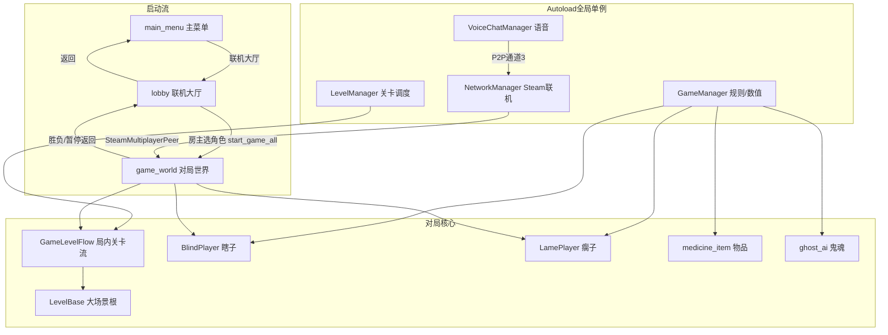
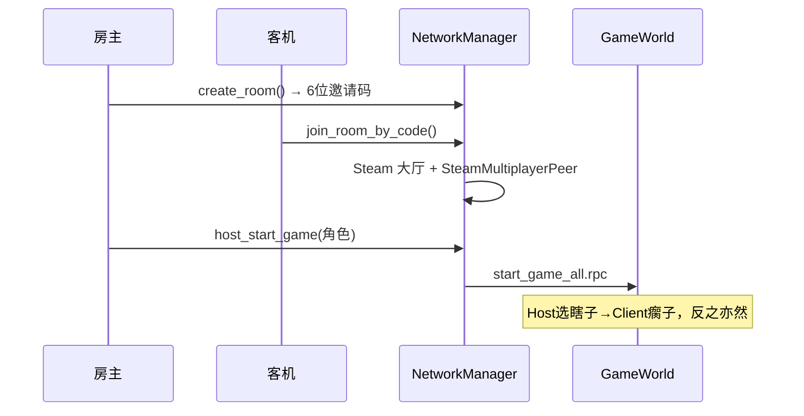
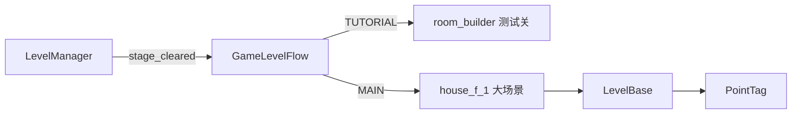
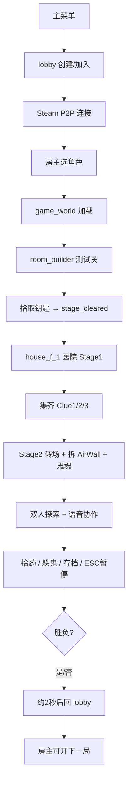
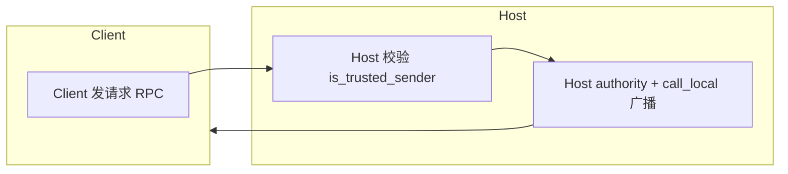

# 《瘸子和瞎子》完整项目架构说明

基于对 `c:\Users\c2930\Desktop\blind_and_lame_Project1\` 的全量扫描（约 **81 个版本管理内文件**），这是一份面向阅读、审查与规划的架构文档。

---

## 一、项目概览

| 项目 | 说明 |
|------|------|
| 引擎 | Godot **4.6**（Forward Plus） |
| 类型 | 双人合作恐怖游戏 |
| 核心玩法 | **瞎子**移动+半圆视野；**瘸子**背负在肩上负责交互+语音 |
| 联机 | **Steam P2P**（`SteamMultiplayerPeer`）+ 独立语音 P2P 通道 |
| 入口 | `main_menu.tscn` → 仅「联机大厅」可进游戏（单机已关闭） |
| Steam AppID | 480（Spacewar 测试用，见 `steam_appid.txt`） |

---

## 二、整体架构图



---

## 三、目录结构总览

```
blind_and_lame_Project1/
├── project.godot           # 项目配置（主场景、Autoload、输入、物理层、Steam）
├── steam_appid.txt         # Steam 测试 AppID
├── export_presets.cfg      # Windows 导出预设
├── README.md               # 已有架构文档（2026-07 版，部分开关描述可能滞后）
├── database_guide.gd       # 存档方案设计（未接入运行）
├── .gitignore              # 忽略 .godot/、scenes/GameModeScene/ 等大资源
├── .gitattributes
├── .vscode/extensions.json # 编辑器扩展推荐
│
├── scripts/                # ★ 全部游戏逻辑（27 个 .gd）
│   ├── LevelSystem/        # 关卡子系统（4 个脚本）
│   └── 地下室.blend        # Blender 源文件（美术，未直接进游戏）
│
├── scenes/                 # ★ 场景与 Prefab（11 个 .tscn）
│   ├── GameModeScene/      # ★ 被 gitignore：houseF1.glb 等大模型需本地放置
│   └── blind_player.gdshader  # 瞎子半圆视野 Shader
│
└── addons/godotsteam/      # Steam 第三方插件（GDExtension + 编辑器面板）
    ├── godotsteam.gdextension
    ├── godotsteam_plugin.gd
    ├── editor/             # Steamworks 编辑器 UI
    └── win64/ 等            # 各平台原生库（运行时依赖）
```

**说明：**
- `.godot/` 为编辑器缓存，不进 Git
- `Levels/`、`Environment/` 在 README 中提及为预留目录，**当前仓库中不存在**
- 大型 3D 关卡模型放在 `scenes/GameModeScene/`，需队友私下同步

---

## 四、Autoload 与全局配置

### 4.1 四个全局单例

| 单例名 | 脚本 | 负责游戏部分 |
|--------|------|-------------|
| `GameManager` | `scripts/game_manager.gd` | 角色、心理值/疼痛值、胜负、谜题、存档点、暂停、语音 Tier |
| `NetworkManager` | `scripts/network_manager.gd` | Steam 初始化、大厅、邀请码、P2P 联机、断线清理 |
| `VoiceChatManager` | `scripts/VoiceCore.gd` | Steam 语音采集/播放、疼痛影响音量 |
| `LevelManager` | `scripts/LevelSystem/LevelManager.gd` | 关卡切换总调度（局内流程 + 整场景切换） |

### 4.2 物理碰撞层（`project.godot`）

| Layer | 名称 | 用途 |
|-------|------|------|
| 1 | environment | 关卡墙体、地板 |
| 2 | player | 瞎子胶囊体（唯一挡墙角色） |
| 3 | ghost | 鬼魂 |
| 4 | items | 物品交互射线 |

### 4.3 输入映射

| 动作 | 键 | 谁用 |
|------|-----|------|
| `move_*` | WASD | 瞎子移动 |
| `interact` | E | 瘸子交互拾取 |
| `pause_game` | ESC | 暂停菜单 |
| `push_to_talk` | V | 按住说话（默认常开麦） |

---

## 五、场景流（UI → 联机 → 对局）



### 场景文件详解

| 文件 | 类型 | 职责 | 对应脚本 |
|------|------|------|----------|
| `scenes/main_menu.tscn` | UI | 入口：联机大厅 / 退出；单机按钮已隐藏 | `main_menu.gd` |
| `scenes/lobby.tscn` | UI | **唯一联机大厅**：创建/加入、邀请码、选角色、断线提示 | `lobby.gd` |
| `scenes/game_world.tscn` | 3D 根 | 对局容器：生成玩家、物品、暂停 UI、关卡流 | `game_world.gd` |
| `scenes/blind_player.tscn` | 玩家 Prefab | 瞎子 + 相机 + 半圆视野 + 心理值 UI | `blind_player.gd` |
| `scenes/lame_player.tscn` | 玩家 Prefab | 瘸子 + 疼痛 UI + 交互射线 | `lame_player.gd` |
| `scenes/medicine_item.tscn` | 可交互物 | 心理药 / 止痛药 / 钥匙线索 | `medicine_item.gd` |
| `scenes/ghost.tscn` | 敌人 Prefab | Stage2 巡逻鬼魂 | `ghost_ai.gd` |
| `scenes/house_f_1.tscn` | 主关卡 | 实例化 `houseF1.glb`，挂 `LevelBase.gd` | `LevelBase.gd` |
| `scenes/blind_player.gdshader` | Shader | 半圆孔视野，孔外纯黑 | — |
| `scenes/test.tscn` | 测试 | GodotSteam 初始化 smoke test | `test.gd` |

---

## 六、脚本模块详解（按职责分组）

### 6.1 网络与大厅层

| 脚本 | 负责内容 | 在游戏中的位置 |
|------|----------|----------------|
| `network_manager.gd` | Steam 初始化、`createLobby`、6 位邀请码搜索、 `SteamMultiplayerPeer`、语音 P2P 通道 3、断线 `hard_cleanup`、场景路径常量 | **联机基础设施** |
| `lobby.gd` | 创建/加入房间 UI、Steam 状态检测、房主选角色开局、对局结束回大厅、断线弹窗、「断开联机」 | **匹配与房间 UI** |
| `main_menu.gd` | 跳转大厅、显示断线提示、退出时清理网络/语音 | **游戏启动入口** |

**联机权威模型：**
- **Host（peer_id=1）** 为 Authority：胜负、暂停、存档、物品拾取、鬼魂 AI、关卡切换
- **Client** 发请求 RPC → Host 校验 `is_trusted_sender` → Host 广播 `call_local`
- `BlindPlayer` 的 multiplayer authority 固定为 1（Host）

---

### 6.2 游戏状态与规则

| 脚本 | 负责内容 |
|------|----------|
| `game_manager.gd` | 心理值（瞎子，持续衰减）/ 疼痛值（瘸子，持续上升）；药物与谜题；`stage_cleared`（测试关→大场景）；`game_over_triggered`；`is_paused` 暂停；疼痛 → 语音 Tier 映射 |

**关键信号：**
- `mental_health_changed` / `pain_value_changed` → UI 与语音
- `stage_cleared` → 测试关通关，进入 `house_f_1`
- `game_over_triggered` → 整局胜负
- `pause_changed` → 暂停同步

---

### 6.3 玩家控制（核心玩法）

| 脚本 | 角色 | 负责内容 |
|------|------|----------|
| `blind_player.gd` | **瞎子** | WASD + 鼠标；`move_and_slide()` 挡墙（layer 2，mask 1）；半圆视野 Shader；心理值 UI；联机位移/旋转同步；暂停时停物理、隐藏 VisionMask |
| `lame_player.gd` | **瘸子** | **零碰撞影子**，跟随 `BlindPlayer/CarryAnchor`；交互射线（E）；疼痛 UI；疼痛值网络同步 |
| `player_pickup_util.gd` | 工具类 | 身前圆柱拾取探测区计算，供双角色共用 |

**协作分工：**
- 瞎子 = 腿 + 墙 + 视野
- 瘸子 = 眼（交互）+ 嘴（语音）
- 疼痛越高 → 瘸子发麦越弱 / 瞎子听瘸子越小声（Tier 0 禁发 + -80dB）

---

### 6.4 语音系统

| 脚本 | 负责内容 |
|------|----------|
| `VoiceCore.gd` | Steam 麦克风采集 → P2P 发送；远端 PCM 解压 → `AudioStreamGenerator` 播放；疼痛 Tier 控制发麦/听筒音量；暂停/恢复/关闭生命周期 |

**疼痛 → 音量（`game_manager.gd`）：**

| 疼痛值 | Tier | 瞎子听到 | 瘸子发麦 |
|--------|------|----------|----------|
| 0~20 | 4 | 0 dB | 正常 |
| 20~50 | 3 | -6 dB | 正常 |
| 50~80 | 2 | -12 dB | 正常 |
| 80~100 | 1 | -20 dB | 正常 |
| =100 | 0 | -80 dB | **禁发麦** |

---

### 6.5 关卡系统（`scripts/LevelSystem/`）



| 脚本 | 职责 |
|------|------|
| `LevelManager.gd` | **两种模式**：① 局内流程（GameLevelFlow，不卸载 GameWorld）；② 整场景切换（`level_array` + 黑屏过渡） |
| `GameLevelFlow.gd` | 测试关 `room_builder` → 实例化 `house_f_1`（Stage1）→ 集齐 Clue1/2/3 → Stage2 转场 → 拆 AirWall + 生成鬼魂 |
| `LevelBase.gd` | 大场景根：碰撞层整理、导航、出生/巡逻组、药品刷新、装饰碰撞优化 |
| `PointTag.gd` | Blender 导出标记点：Spawn / Patrol 分组 |
| `room_builder.gd` | 程序化生成 16×16 测试房间（地板/墙/家具/灯光） |

**当前关卡流程（代码实际行为）：**
1. `GameWorld._ready` → `GameLevelFlow.build_initial_room()` 先加载**测试关**
2. 测试关集齐钥匙 → `GameManager.stage_cleared` → 淡入淡出进入 `house_f_1`
3. 医院 Stage1 集齐 Clue → `switch_to_stage(2)` 同场景切换
4. Stage2：移除 AirWall、显示 `stage2_only` 分组、生成 `ghost_ai`

---

### 6.6 玩法与交互

| 脚本 | 负责内容 |
|------|----------|
| `networked_authority_interactable.gd` | **联机交互基类**：Client 请求 → Host 校验 → 全网广播 |
| `medicine_item.gd` | Type0 心理药 / Type1 止痛药 / Type2 钥匙线索；Host 距离+视线校验；拾取 Tween |
| `ghost_ai.gd` | PATROL → CHASE → RETURN 状态机；Host 跑 NavigationAgent；Client 插值 |
| `checkpoint_trigger.gd` | Area3D：玩家进入 → 通知 `GameWorld` 保存存档点 |
| `light_flicker.gd` | 挂载 Light3D 子节点，随机闪烁（氛围） |
| `input_mouse_guard.gd` | 工具类：UI 显示时释放鼠标，恢复游戏时捕获 |
| `pause_input_relay.gd` | `PROCESS_MODE_ALWAYS`，暂停时仍能轮询 ESC |

---

### 6.7 对局容器（`game_world.gd`）

| 职责 | 说明 |
|------|------|
| 联机校验 | 非联机直接踢回 `lobby` |
| 关卡流 | 创建 `GameLevelFlow`，加载测试关/大场景 |
| 玩家生成 | Host 读 `PlayerSpawnPoint` → RPC 同步 Client |
| 物品/存档 | 测试关刷物品；存档点触发 |
| 暂停系统 | `PauseInputRelay`（ALWAYS）轮询 ESC；暂停 UI layer=100 |
| 淡入淡出 | 切关/重试黑屏过渡 |
| 胜负 | 约 2 秒后回 `lobby.tscn` |

---

### 6.8 其他文件

| 文件 | 说明 |
|------|------|
| `database_guide.gd` | JSON / SQLite / Steam Cloud 存档方案设计，**尚未接入 Autoload** |
| `scenes/test.gd` | GodotSteam 初始化 smoke test |
| `*.gd.uid` | Godot 4 脚本 UID 元数据，自动生成，无需手改 |
| `scripts/地下室.blend` | Blender 源文件，供美术导出 glb |

---

## 七、addons/godotsteam（第三方插件）

| 内容 | 说明 |
|------|------|
| `godotsteam.gdextension` | GDExtension 原生库入口 |
| `win64/` 等 | 各平台 Steam API 二进制 |
| `editor/` | 编辑器 Steamworks 面板与更新检查 |
| `plugin.cfg` | 已在 `project.godot` 启用 |

提供：`Steam.steamInitEx()`、`createLobby`、`SteamMultiplayerPeer`、语音 API 等。**不要修改插件核心逻辑**，游戏层通过 `NetworkManager` / `VoiceCore` 封装调用。

---

## 八、功能模块 → 游戏内容映射表

| 游戏内容 | 负责模块 | 关键文件 |
|----------|----------|----------|
| 启动 / 退出 | 主菜单 | `main_menu.gd`, `main_menu.tscn` |
| 联机匹配 | Steam 大厅 | `network_manager.gd`, `lobby.gd` |
| 角色分配 | 网络 + 状态 | `lobby.gd` → `start_game_all` |
| 瞎子移动与视野 | 玩家 | `blind_player.gd`, `blind_player.gdshader` |
| 瘸子交互与背负 | 玩家 | `lame_player.gd` |
| 双人语音 + 疼痛音量 | 语音 | `VoiceCore.gd` + `NetworkManager` P2P |
| 心理值 / 疼痛值 | 规则 | `game_manager.gd` |
| 拾取药物 / 钥匙 | 交互 | `medicine_item.gd`, `networked_authority_interactable.gd` |
| 测试关卡 | 程序化场景 | `room_builder.gd` |
| 主关卡（医院/大屋） | 美术场景 | `house_f_1.tscn`, `LevelBase.gd` |
| 关卡进度 / Stage 切换 | 关卡流 | `GameLevelFlow.gd`, `LevelManager.gd` |
| 鬼魂追逐 | 敌人 AI | `ghost_ai.gd`, `ghost.tscn` |
| 存档点 / 重试 | 进度 | `checkpoint_trigger.gd`, `game_world.gd` |
| 暂停 / 回大厅 | UI + 网络 | `game_world.gd`, `GameManager` |
| 胜负判定 | 规则 | `game_manager.gd` → 回 `lobby.tscn` |
| 氛围灯光 | 环境 | `light_flicker.gd` |

---

## 九、一局游戏的完整数据流



---

## 十、RPC 权威调用关系（联机核心）



| 功能 | RPC 模式 | 发起方 |
|------|---------|--------|
| 暂停/恢复 | authority + call_local | 任意端 → Host 裁决 |
| 物品拾取 | Client 请求 → Host 广播 | 交互方 |
| 玩家生成 | authority + call_remote | Host |
| 关卡切换 | authority + call_local | Host |
| 疼痛同步 | any_peer unreliable | 本地瘸子 |
| 瞎子位移同步 | any_peer / authority unreliable | Client 意图 / Host 广播 |
| 胜负 | authority + call_local | Host 裁决 |

---

## 十一、审查与规划建议

### 已较成熟
- Steam P2P 联机全流程（大厅、邀请码、断线回 lobby）
- 双角色差异化玩法（移动/交互/视野/语音）
- Host 权威 + RPC 交互框架
- 关卡系统骨架（测试关 → 大场景 → Stage2 鬼魂）
- Steam 语音与疼痛 Tier 联动
- 暂停系统（ESC 双端、数值冻结、UI 层级）

### 进行中 / 待完善
| 项 | 说明 |
|----|------|
| `scenes/GameModeScene/houseF1.glb` | 被 Git 忽略，需本地/队友同步 |
| `database_guide.gd` | 存档系统尚未实现 |
| `STAGE2_CLUE_NAMES` | `GameLevelFlow.gd` 中为空，Stage2 通关线索待摆放 |
| 单机模式 | `main_menu.gd` 中入口已注释，本地调试需恢复 |
| `LevelManager.level_array` | 整场景切换数组当前为空 |

### 扩展新内容时的推荐入口

| 想做什么 | 改哪里 |
|----------|--------|
| 新关卡场景 | 新建 `.tscn` + 挂 `LevelBase.gd` → 加入 `LevelManager.level_array` 或由 `GameLevelFlow` 实例化 |
| 新可交互物 | 继承 `NetworkedAuthorityInteractable` |
| 新敌人 | 参考 `ghost_ai.gd`，Host 算 AI + RPC 同步 |
| 新 UI 流程 | 新建 `scenes/*.tscn` + 对应 `scripts/*.gd` |
| 存档/统计 | 按 `database_guide.gd` 实现 `SaveManager` Autoload |

---

## 十二、分层总结（便于快速定位）

```
┌─────────────────────────────────────────────────┐
│  UI 层：main_menu / lobby / game_world 暂停 UI   │
├─────────────────────────────────────────────────┤
│  网络层：NetworkManager + Steam P2P + VoiceCore  │
├─────────────────────────────────────────────────┤
│  规则层：GameManager（数值、胜负、暂停、语音Tier） │
├─────────────────────────────────────────────────┤
│  玩法层：BlindPlayer / LamePlayer / medicine_item│
│          ghost_ai / checkpoint_trigger           │
├─────────────────────────────────────────────────┤
│  关卡层：LevelManager / GameLevelFlow / LevelBase │
│          room_builder / PointTag                 │
├─────────────────────────────────────────────────┤
│  资源层：scenes/*.tscn + GameModeScene/*.glb     │
│          blind_player.gdshader / 地下室.blend    │
├─────────────────────────────────────────────────┤
│  基础设施：addons/godotsteam / project.godot     │
└─────────────────────────────────────────────────┘
```

---
